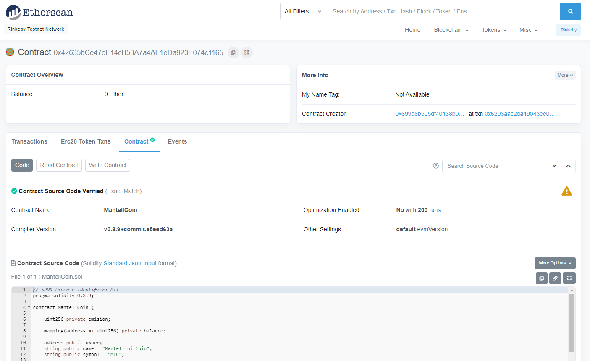

# MantellCoin
## _Crowd-selling MantellCoin to Discover Interesting Facts on our best friends_

## **Overview**
Crowd-selling MantellCoin coded on Solidity to fund generic trailing project.Contract was written and deployed on VSC. 

---
### **Transaction on EtherScan for # MantellCoin Contract Deployment**


### **Crowdsale Contract Deployment on VSC**

**Step 1. Deploy  Deployer Contract**

i) Enter the following information at **DEPLOY**:
```
NAME: MantelliniCoin
SYMBOL: MLC
GOAL: 1000
```
ii) Click on **transact** button. 


iii) Confirm on MetaMask pop-up window.

---

# References
* http://remix.ethereum.org/
* https://faucet.ropsten.be/
* https://kovan.etherscan.io/
* https://solidity.readthedocs.io/
* https://medium.com/coinmonks/create-token-contract-and-time-limited-crowdsale-contract-with-whitelisting-in-solidity-1eb979d206f6
* https://ethereum.stackexchange.com/questions/51757/basic-crowdsale-contract
* https://ethereum.stackexchange.com/questions/51757/basic-crowdsale-contract
* https://github.com/raineorshine/solidity-by-example
* https://github.com/bkrem/awesome-solidity
* https://solidity.readthedocs.io/en/v0.5.3/solidity-by-example.html#simple-open-auction
